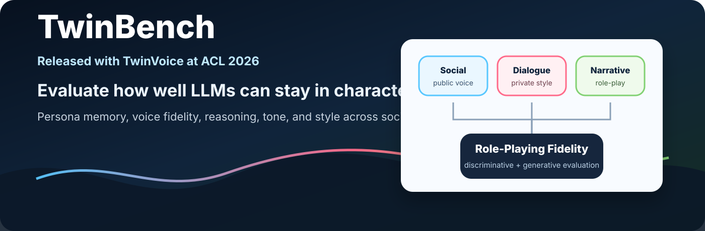
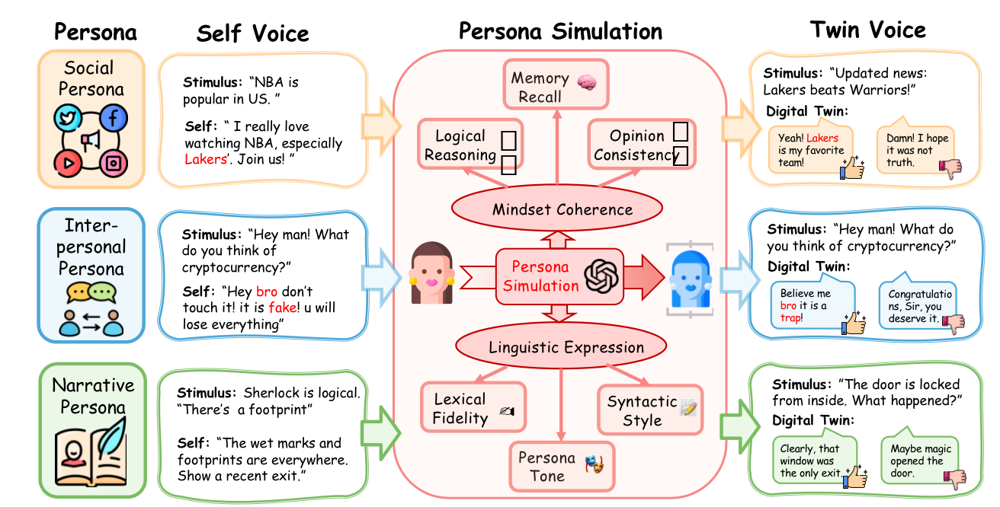

# TwinBench

<p align="center">
  
</p>

<p align="center">
  <b>A benchmark for evaluating role-playing fidelity, persona simulation, and self-voice consistency in large language models.</b>
</p>

<p align="center">
  <a href="#quickstart">Quickstart</a> |
  <a href="#starter-panel">Starter panel</a> |
  <a href="#what-twinbench-measures">What it measures</a> |
  <a href="#evaluation-modes">Evaluation modes</a> |
  <a href="#citation">Citation</a>
</p>

TwinBench is the evaluation benchmark released with **TwinVoice (ACL 2026)**.
It tests whether a model can preserve a target persona's beliefs, memory,
reasoning, tone, lexical habits, and syntactic style when acting as that persona.

Unlike general chat benchmarks, TwinBench asks a sharper question:

> Can the model stay in character when the correct answer depends on a person's
> history, profile, relationships, and voice?

## Highlights

- **Role-playing evaluation for LLMs**: measure whether a model can act as a
  specific speaker, not only produce helpful generic answers.
- **Three persona settings**: social-media voice, private dialogue style, and
  narrative character role-play.
- **Two evaluation families**: low-cost discriminative evaluation and richer
  generative evaluation with LLM-as-a-judge.
- **Low-token quick eval**: run a small smoke test with one command before
  launching full experiments.
- **OpenAI-compatible endpoints**: works with OpenAI-style APIs, local vLLM
  servers, and compatible model gateways.
- **Model notes included**: see [`docs/model_notes.md`](docs/model_notes.md)
  for role-play model families and provider-specific tips.

## Starter Panel

TwinBench ships with a compact six-model starter panel for quickly comparing
role-playing fidelity across all three persona settings. The table below is a
lightweight `small` preset smoke run with 50 examples per dimension; use it as
a reproducibility check and preview, not as a final paper-scale leaderboard.

| Rank | Model | D1 Social | D2 Dialogue | D3 Character | Macro Avg |
| ---: | --- | ---: | ---: | ---: | ---: |
| 1 | `claude-sonnet-4-6` | 62.0 | 80.0 | 96.0 | 79.3 |
| 2 | `gemini-3.5-flash-nothinking` | 50.0 | 84.0 | 100.0 | 78.0 |
| 3 | `gemini-3-flash-preview-nothinking` | 58.0 | 76.0 | 100.0 | 78.0 |
| 4 | `deepseek-v4-flash-nothinking` | 50.0 | 62.0 | 94.0 | 68.7 |
| 5 | `gpt-5.2-chat-latest` | 50.0 | 70.0 | 82.0 | 67.3 |
| 6 | `deepseek-v4-pro` | 50.0 | 48.0 | 98.0 | 65.3 |

Scores are percentages. Full counts, parse-failure notes, and reproduction
details are in [`docs/benchmark_results.md`](docs/benchmark_results.md).

## Quickstart

### 1. Install

```bash
git clone https://github.com/TwinVoice/TwinBench.git
cd TwinBench
python -m venv .venv
source .venv/bin/activate
pip install -r requirements.txt
```

On Windows PowerShell:

```powershell
python -m venv .venv
.\.venv\Scripts\Activate.ps1
pip install -r requirements.txt
```

### 2. Configure an OpenAI-compatible endpoint

For OpenAI or an API gateway:

```bash
export OPENAI_API_KEY="your-api-key"
export OPENAI_BASE_URL="https://api.openai.com/v1"
```

For a local vLLM server:

```bash
export TWINVOICE_TWIN_BASE_URL="http://localhost:8005/v1"
export TWINVOICE_TWIN_API_KEY="EMPTY"
```

PowerShell equivalent:

```powershell
$env:OPENAI_API_KEY="your-api-key"
$env:OPENAI_BASE_URL="https://api.openai.com/v1"
```

API keys are read from environment variables by `twinvoice/api_config.py`.
Do not put secrets into source files or README files.

### 3. Run the lowest-cost smoke test

Dimension 3 is the friendliest public demo: narrative role-play with character
profiles and multiple-choice voice matching.

```bash
python -m twinvoice.evaluate --dimension 3 --preset tiny --model gpt-4o-mini
```

The same entrypoint also supports Dimension 1 and Dimension 2:

```bash
python -m twinvoice.evaluate --dimension 1 --preset tiny --model gpt-4o-mini
python -m twinvoice.evaluate --dimension 2 --preset tiny --model gpt-4o-mini
```

This runs a 5-sample discriminative evaluation, clips long profile/context
fields, and writes outputs to `result/quick_eval/`.

Use a larger but still lightweight run with:

```bash
python -m twinvoice.evaluate --dimension 3 --preset small --model gpt-4o-mini
```

Run the recommended six-model starter panel with one command:

```bash
python -m twinvoice.evaluate --dimension all --preset small --models starter
```

### Optional: no-token local smoke test

To verify installation without spending API tokens, run the mock server in one
terminal:

```bash
python tools/mock_openai_server.py --port 8765
```

Then run the quick eval in another terminal:

```bash
export TWINVOICE_TWIN_BASE_URL="http://127.0.0.1:8765/v1"
export TWINVOICE_TWIN_API_KEY="EMPTY"
python -m twinvoice.evaluate --dimension 3 --preset tiny --model mock-model
```

The mock server always returns deterministic toy answers. It tests plumbing, not
model quality.

## What TwinBench Measures

TwinBench evaluates role-playing fidelity across three complementary persona
settings:

| Dimension | Persona setting | Core question | Dataset |
| --- | --- | --- | --- |
| 1 | Social Persona | Can the model match a user's public social-media voice? | `dataset/dimension_1/` |
| 2 | Interpersonal Persona | Can the model identify a user's private dialogue style from history? | `dataset/dimension_2/` |
| 3 | Narrative Persona | Can the model speak as a fictional or defined character in context? | `dataset/dimension_3/` |

The benchmark reports capability-level behavior across:

| Category | Capabilities |
| --- | --- |
| Mindset Coherence | `Opinion_Consistency`, `Memory_Recall`, `Logical_Reasoning` |
| Linguistic Expression | `Lexical_Fidelity`, `Persona_Tone`, `Syntactic_Style` |

<p align="center">
  
</p>

## Evaluation Modes

### Discriminative evaluation

Recommended for quick runs and model comparison. The model sees persona context
and four candidate replies, then selects the reply most likely written by the
target persona.

```bash
python -m twinvoice.evaluate --dimension 3 --preset tiny --model MODEL_NAME
```

Advanced Dimension 3 command:

```bash
python -m twinvoice.discriminative.dimension_3.evaluate \
  dataset/dimension_3/choices.jsonl \
  dataset/dimension_3/profiles.jsonl \
  --model MODEL_NAME \
  --sample 20 \
  --history-max 8 \
  --profile-max-chars 900 \
  --context-max-chars 1500 \
  --choice-max-chars 400 \
  --report result/discriminative/dimension_3/results.jsonl
```

Advanced Dimension 2 command:

```bash
python -m twinvoice.discriminative.dimension_2.evaluate \
  --input dataset/dimension_2/conversation_data.jsonl \
  --model MODEL_NAME \
  --sample 20 \
  --history-max 8 \
  --context-max-chars 1500 \
  --choice-max-chars 400 \
  --report result/discriminative/dimension_2/results.jsonl \
  --wrong-report result/discriminative/dimension_2/wrong_cases.jsonl
```

### Generative evaluation

For deeper analysis, first ask the model to generate a persona-consistent reply,
then use an LLM judge to map or score the generated reply against the reference.
This mode costs more tokens but gives richer failure analysis.

Dimension 3 generation:

```bash
python -m twinvoice.generative.Dimension_3.gen_step1 \
  --input dataset/dimension_3/choices.jsonl \
  --profile dataset/dimension_3/profiles.jsonl \
  --gen_model MODEL_NAME \
  --out_dir result/generative/dimension_3 \
  --sample 20 \
  --workers 4 \
  --history-max 8
```

Dimension 3 judging:

```bash
python -m twinvoice.generative.Dimension_3.judge_step2 \
  --input result/generative/dimension_3/step1_generations_*.jsonl \
  --judge_model JUDGE_MODEL \
  --workers 4
```

Dimension 2 generation and judging:

```bash
python -m twinvoice.generative.Dimension_2.gen_step1 \
  --input dataset/dimension_2/conversation_data.jsonl \
  --gen_model MODEL_NAME \
  --out_dir result/generative/dimension_2 \
  --sample 20 \
  --workers 4 \
  --temperature 0.0

python -m twinvoice.generative.Dimension_2.judge_step2 \
  --input result/generative/dimension_2/step1_generations_MODEL_NAME.jsonl \
  --judge_model JUDGE_MODEL \
  --workers 4 \
  --temperature 0.0
```

## Low-Token Presets

The one-command interface defaults to discriminative evaluation because it needs
only one model call per sample and no judge call.

| Preset | Samples | History items | Text clipping | Use case |
| --- | ---: | ---: | --- | --- |
| `tiny` | 5 | 4 | aggressive | endpoint smoke test |
| `small` | 50 | 8 | moderate | cheap model comparison |
| `full` | all | 30 | none | paper-scale evaluation |

Override any preset field when needed:

```bash
python -m twinvoice.evaluate \
  --dimension 3 \
  --preset tiny \
  --sample 10 \
  --history-max 6 \
  --profile-max-chars 700 \
  --model MODEL_NAME
```

## Project Structure

```text
TwinBench/
  dataset/
    dimension_1/                 # Social persona data
    dimension_2/                 # Interpersonal dialogue data
    dimension_3/                 # Narrative persona choices and profiles
  Figs/                          # README and paper figures
  result/                        # Released result examples
  twinvoice/
    api_config.py                # Safe environment-variable config
    evaluate.py                  # One-command low-token evaluation
    discriminative/
      dimension_1/
      dimension_2/
      dimension_3/
    generative/
      Dimension_1/
      Dimension_2/
      Dimension_3/
```

## Data Note

Some social and interpersonal data contains user-generated text from online
settings. It may include offensive, biased, or otherwise uncomfortable language.
The benchmark preserves such text for persona/style evaluation; users should
apply appropriate filtering and safety review before demos or downstream use.

## Security Note

Never commit local API keys, private runbooks, or `.env` files. If a key is ever
committed to a public repository, revoke the key immediately and purge it from
Git history before announcing the release.

## Citation

If TwinBench or TwinVoice helps your work, please cite the paper. BibTeX will be
updated here with the camera-ready ACL 2026 metadata.
